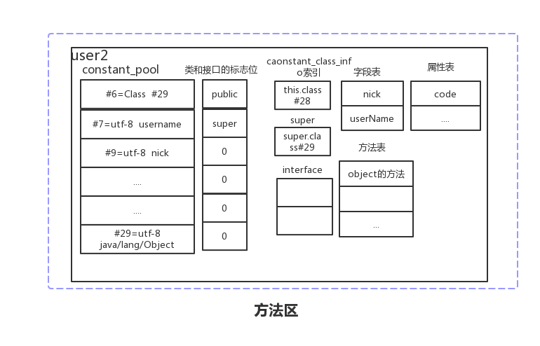
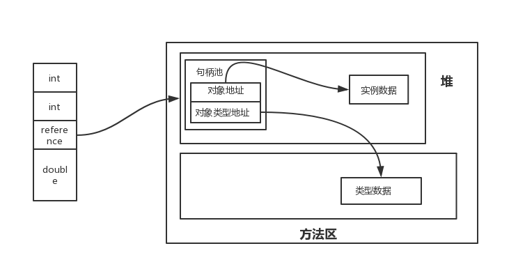
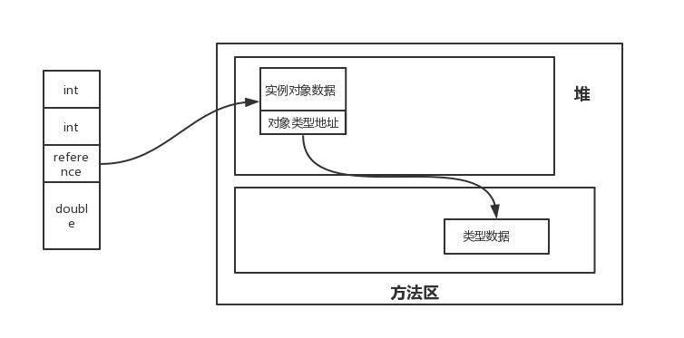

# java运行时数据区
> 运行时数据区随着java虚拟机的启动而生成, 关闭而销毁, 运行时数据区被分为程序计数器、 虚拟机栈、 本地方法栈、 方法区、 堆 
- [x] 方法区
- [x] Java堆 
- [x] 程序计数器
- [x] Java栈
- [x] 本地方法栈
- [x] 对象访问方式
- [x] 简单的程序


## 方法区
方法区中主要存放的是类型数据, 因为类型数据也会在程序运行的时候动态加载其他类型 (动态代理, 通过网络加载class文件), 所以方法区也是GC的对象。之前在讲 &nbsp;[类型的生命周期](./类型的生命周期.md) &nbsp;时说过, 加载主要是把二进制流解析到方法区的数据结构中。 


**方法区中主要是什么:**

<div align="center">  </div><br>

1. 常量池
    - 所有字符串(方法描述, 类描述, 字段名等等)
    - 类变量基本类型字面量
    - 引用符号

2. 标志位
   - 这个是类或者接口的标志位

3. 类和父类和实现接口的索引
   - 主要索引到常量池的constant_class_info

4. 字段表
   - 字段标志位
   - 字段简单名称和描述标识符
   - 附加属性(是外部类的属性?如果没有就为0)

5. 方法表
   - 方法描述标识符和方法简单名称
   - 方法标志位
   - 附加属性(code 编译的本地代码等属性)

6. 属性表
   - 定义一些附加的属性

这些都是Class文件的内容, 如果不理解可以看 [类文件解析](类文件解析.md) 

**关于常量池：**

1. 静态常量池
    Class文件在编译时候生成的常量池。
2. 运行时常量池
   在类加载的时候把静态常量池中的数据解析到运行时常量池中, 部分解析为直接引用
3. 字符串常量池
   在类加载之前会在堆空间初始化一块字符串常量池内存, 用来存放常用字符的引用, 实例是存放堆内存中

在方法区中, 会把上面的东西读入到像上图差不多的东西, 常量池中的字符字面常量在类加载的时候会存放到字符串常量池中, 类型的运行时常量池中存放指向该字符的索引。在方法区中每个类型还会记录classLoad对象的引用和class对象的引用

`Jdk 1.7` 以前是方法区也叫非堆, 因为方法区里面是类型和运行时常量池和编译的本地代码, 几乎GC很难对器回收, 经常会出现OOM问题, 在 `Jdk 1.8` 之后, 把方法区的内存移到元数据区(本地内存), 根据类加载器来分组为多个元数据区域, 当某个类加载器实例被回收时, 那该对应的元数据区也可被释放。

## Java堆
堆是和方法区一样也是线程共享的, Java堆上面主要存储的是对象实例和数组对象, 常量池(字符串, Integer ...), GC收集器的工作也是主要回收这一部分空间。

但是随着JIT编译器的发展和逃逸技术的成熟, 通过 `栈上分配` `标量替换` , 使对象不一定存在堆上。

1. 栈上分配
    当没有发生对象逃逸的现象, 对象分配在栈空间中,在一个方法中, 执行完则销毁。逃逸就是对象传入下个方法, 或者传入到其他线程中(栈上分配难度还是比较大)
2. 标量替换
   当没有发生对象逃逸的现象, 对象中的变量可以替换成基本类型的局部变量时, 执行完者销毁

## Java栈
`Java栈` 随着线程的创建而创建, 销毁而销毁。 每个线程私有线程栈, 线程栈是由`栈帧` 组成, `栈帧` 里有 `局部变量表`、`操作数栈` 他们的大小在编译成Class文件的时候就确定了, `栈帧数据区` 存放的是异常表等数据。每个栈帧都有指向运行时常量池中对应的方法的地址, 当在调用时,会通过动态连接, 把运行时常量池中的符号引用解析成直接引用。

## 程序计数器
程序计数器为一块比较小的内存, java的解释器执行字节码文件主要依靠程序计数器的值来选取需要执行的指令


## 对象访问方式

**句柄访问**
因为对象实例和类型数据放在不同的地方, 当你获取对象时是通过对象实例拿到数据, 调用方法是通过类型的方法表来确定执行的方法, 在GC回收时, 整理内存空间时, 会涉及到对象实例地址变化或类型地址变化, 如果有个对象句柄, 只需要改变对象句柄里对象的地址即可, 不用去到每个栈空间的局部变量表中改变refrece的地址, 但是对象就需要两次定位了、

<div align="center">  </div><br>

**直接访问**
不需要句柄, 对象的访问速度比较快。
<div align="center">  </div><br>


## 简单的程序

我们创建了一个 `User` 类型的类, 类变量 `userName` 和成员变量 `age` , `Test` 是一个简单算年龄赋值给 `user`

```java
public class User {
    private static String userName = "xgx";
    private Integer age;
    public Integer getAge() {
        return age;
    }
    public void setAge(Integer age) {
        this.age = age;
    }
    @Override
    public String toString() {
        return "User{" +
                "age=" + age +"name = "+ userName+
                '}';
    }
}

public class Test {
    public static void main(String[] args) throws InterruptedException {
        User user = new User();
        Integer age = findAge(1995, 2019);
        user.setAge(age);
    }
    static Integer findAge(Integer startYear, Integer endYear){
        if(endYear - startYear < 0){
            return 20;
        }
        return endYear - startYear;
    }
}
```

首先从 `User` 字节码开始：

```text
  Last modified 2019-1-9; size 1058 bytes
  MD5 checksum 1374de8319b66441f7be17ef6b63eff7
  Compiled from "User.java"
public class basic.learning.jvm.runningdatablock.example1.User
  minor version: 0  
  major version: 52 //主版本
  flags: ACC_PUBLIC, ACC_SUPER  //类标志位
Constant pool:  //静态常量池
   #1 = Methodref          #14.#35        // java/lang/Object."<init>":()V
   #2 = Fieldref           #13.#36        // basic/learning/jvm/runningdatablock/example1/User.age:Ljava/lang/Integer;
   #3 = Class              #37            // java/lang/StringBuilder
   #4 = Methodref          #3.#35         // java/lang/StringBuilder."<init>":()V
   #5 = String             #38            // User{age=
   #6 = Methodref          #3.#39         // java/lang/StringBuilder.append:(Ljava/lang/String;)Ljava/lang/StringBuilder;
   #7 = Methodref          #3.#40         // java/lang/StringBuilder.append:(Ljava/lang/Object;)Ljava/lang/StringBuilder;
   #8 = String             #41            // name =
   #9 = Fieldref           #13.#42        // basic/learning/jvm/runningdatablock/example1/User.userName:Ljava/lang/String;
  #10 = Methodref          #3.#43         // java/lang/StringBuilder.append:(C)Ljava/lang/StringBuilder;
  #11 = Methodref          #3.#44         // java/lang/StringBuilder.toString:()Ljava/lang/String;
  #12 = String             #45            // xgx
  #13 = Class              #46            // basic/learning/jvm/runningdatablock/example1/User
  #14 = Class              #47            // java/lang/Object
  #15 = Utf8               userName
  #16 = Utf8               Ljava/lang/String;
  #17 = Utf8               age
  #18 = Utf8               Ljava/lang/Integer;
  #19 = Utf8               <init>
  #20 = Utf8               ()V
  #21 = Utf8               Code
  #22 = Utf8               LineNumberTable
  #23 = Utf8               LocalVariableTable
  #24 = Utf8               this
  #25 = Utf8               Lbasic/learning/jvm/runningdatablock/example1/User;
  #26 = Utf8               getAge
  #27 = Utf8               ()Ljava/lang/Integer;
  #28 = Utf8               setAge
  #29 = Utf8               (Ljava/lang/Integer;)V
  #30 = Utf8               toString
  #31 = Utf8               ()Ljava/lang/String;
  #32 = Utf8               <clinit>
  #33 = Utf8               SourceFile
  #34 = Utf8               User.java
  #35 = NameAndType        #19:#20        // "<init>":()V
  #36 = NameAndType        #17:#18        // age:Ljava/lang/Integer;
  #37 = Utf8               java/lang/StringBuilder
  #38 = Utf8               User{age=
  #39 = NameAndType        #48:#49        // append:(Ljava/lang/String;)Ljava/lang/StringBuilder;
  #40 = NameAndType        #48:#50        // append:(Ljava/lang/Object;)Ljava/lang/StringBuilder;
  #41 = Utf8               name =
  #42 = NameAndType        #15:#16        // userName:Ljava/lang/String;
  #43 = NameAndType        #48:#51        // append:(C)Ljava/lang/StringBuilder;
  #44 = NameAndType        #30:#31        // toString:()Ljava/lang/String;
  #45 = Utf8               xgx
  #46 = Utf8               basic/learning/jvm/runningdatablock/example1/User
  #47 = Utf8               java/lang/Object
  #48 = Utf8               append
  #49 = Utf8               (Ljava/lang/String;)Ljava/lang/StringBuilder;
  #50 = Utf8               (Ljava/lang/Object;)Ljava/lang/StringBuilder;
  #51 = Utf8               (C)Ljava/lang/StringBuilder;
{ //方法表
  public basic.learning.jvm.runningdatablock.example1.User();
    //这个方法是默认的构造函数
    descriptor: ()V //方法返回值
    flags: ACC_PUBLIC //标志位
    Code: 
      stack=1, locals=1, args_size=1 //栈顶 和局部变量表 和参数
         0: aload_0
         1: invokespecial #1                  // Method java/lang/Object."<init>":()V 调用父类构造函数
         4: return
      LineNumberTable: //上面aload_0 对应的源代码行号
        line 9: 0
      LocalVariableTable: //局部变量表, 实例方法第一个参数是this
        Start  Length  Slot  Name   Signature
            0       5     0  this   Lbasic/learning/jvm/runningdatablock/example1/User;

  static {}; //初始化类变量在类型加载的初始化阶段时候执行
    descriptor: ()V
    flags: ACC_STATIC
    Code:
      stack=1, locals=0, args_size=0
         0: ldc           #12                 // String xgx
         2: putstatic     #9                  // Field userName:Ljava/lang/String;
         5: return
      LineNumberTable:
        line 11: 0
}
SourceFile: "User.java"

```
上面简单看了下 `User` 类型的字节码。

```text
public class basic.learning.jvm.runningdatablock.example1.Test
  minor version: 0
  major version: 52
  flags: ACC_PUBLIC, ACC_SUPER
Constant pool:
   #1 = Methodref          #9.#34         // java/lang/Object."<init>":()V
   #2 = Class              #35            // basic/learning/jvm/runningdatablock/example1/User
   #3 = Methodref          #2.#34         // basic/learning/jvm/runningdatablock/example1/User."<init>":()V
   #4 = Methodref          #36.#37        // java/lang/Integer.valueOf:(I)Ljava/lang/Integer;
   #5 = Methodref          #8.#38         // basic/learning/jvm/runningdatablock/example1/Test.findAge:(Ljava/lang/Integer;Ljava/lang/Integer;)Ljava/lang/Integer;
   #6 = Methodref          #2.#39         // basic/learning/jvm/runningdatablock/example1/User.setAge:(Ljava/lang/Integer;)V
   #7 = Methodref          #36.#40        // java/lang/Integer.intValue:()I
   #8 = Class              #41            // basic/learning/jvm/runningdatablock/example1/Test
   #9 = Class              #42            // java/lang/Object
  #10 = Utf8               <init>
  #11 = Utf8               ()V
  #12 = Utf8               Code
  #13 = Utf8               LineNumberTable
  #14 = Utf8               LocalVariableTable
  #15 = Utf8               this
  #16 = Utf8               Lbasic/learning/jvm/runningdatablock/example1/Test;
  #17 = Utf8               main
  #18 = Utf8               ([Ljava/lang/String;)V
  #19 = Utf8               args
  #20 = Utf8               [Ljava/lang/String;
  #21 = Utf8               user
  #22 = Utf8               Lbasic/learning/jvm/runningdatablock/example1/User;
  #23 = Utf8               age
  #24 = Utf8               Ljava/lang/Integer;
  #25 = Utf8               Exceptions
  #26 = Class              #43            // java/lang/InterruptedException
  #27 = Utf8               findAge
  #28 = Utf8               (Ljava/lang/Integer;Ljava/lang/Integer;)Ljava/lang/Integer;
  #29 = Utf8               startYear
  #30 = Utf8               endYear
  #31 = Utf8               StackMapTable
  #32 = Utf8               SourceFile
  #33 = Utf8               Test.java
  #34 = NameAndType        #10:#11        // "<init>":()V
  #35 = Utf8               basic/learning/jvm/runningdatablock/example1/User
  #36 = Class              #44            // java/lang/Integer
  #37 = NameAndType        #45:#46        // valueOf:(I)Ljava/lang/Integer;
  #38 = NameAndType        #27:#28        // findAge:(Ljava/lang/Integer;Ljava/lang/Integer;)Ljava/lang/Integer;
  #39 = NameAndType        #47:#48        // setAge:(Ljava/lang/Integer;)V
  #40 = NameAndType        #49:#50        // intValue:()I
  #41 = Utf8               basic/learning/jvm/runningdatablock/example1/Test
  #42 = Utf8               java/lang/Object
  #43 = Utf8               java/lang/InterruptedException
  #44 = Utf8               java/lang/Integer
  #45 = Utf8               valueOf
  #46 = Utf8               (I)Ljava/lang/Integer;
  #47 = Utf8               setAge
  #48 = Utf8               (Ljava/lang/Integer;)V
  #49 = Utf8               intValue
  #50 = Utf8               ()I
{  //构造方法
  public basic.learning.jvm.runningdatablock.example1.Test();
    descriptor: ()V
    flags: ACC_PUBLIC
    Code:
      stack=1, locals=1, args_size=1
         0: aload_0
         1: invokespecial #1                  // Method java/lang/Object."<init>":()V
         4: return
      LineNumberTable:
        line 9: 0
      LocalVariableTable:
        Start  Length  Slot  Name   Signature
            0       5     0  this   Lbasic/learning/jvm/runningdatablock/example1/Test;

  public static void main(java.lang.String[]) throws java.lang.InterruptedException;
    descriptor: ([Ljava/lang/String;)V
    flags: ACC_PUBLIC, ACC_STATIC
    Code:
      stack=2, locals=3, args_size=1
         0: new           #2                  // class basic/learning/jvm/runningdatablock/example1/User  //创建user对象
         3: dup
         4: invokespecial #3                  // Method basic/learning/jvm/runningdatablock/example1/User."<init>":()V //执行构造函数
         7: astore_1                  
         8: sipush        1995
        11: invokestatic  #4                  // Method java/lang/Integer.valueOf:(I)Ljava/lang/Integer;
        14: sipush        2019
        17: invokestatic  #4                  // Method java/lang/Integer.valueOf:(I)Ljava/lang/Integer;
        20: invokestatic  #5                  // Method findAge:(Ljava/lang/Integer;Ljava/lang/Integer;)Ljava/lang/Integer;
        23: astore_2
        24: aload_1
        25: aload_2
        26: invokevirtual #6                  // Method basic/learning/jvm/runningdatablock/example1/User.setAge:(Ljava/lang/Integer;)V
        29: return
      LineNumberTable:
        line 12: 0
        line 13: 8
        line 14: 24
        line 15: 29
      LocalVariableTable:
        Start  Length  Slot  Name   Signature
            0      30     0  args   [Ljava/lang/String;
            8      22     1  user   Lbasic/learning/jvm/runningdatablock/example1/User;
           24       6     2   age   Ljava/lang/Integer;
    Exceptions:
      throws java.lang.InterruptedException

  static java.lang.Integer findAge(java.lang.Integer, java.lang.Integer);
    descriptor: (Ljava/lang/Integer;Ljava/lang/Integer;)Ljava/lang/Integer;
    flags: ACC_STATIC
    Code:
      stack=2, locals=2, args_size=2
         0: aload_1
         1: invokevirtual #7                  // Method java/lang/Integer.intValue:()I
         4: aload_0
         5: invokevirtual #7                  // Method java/lang/Integer.intValue:()I
         8: isub
         9: ifge          18
        12: bipush        20
        14: invokestatic  #4                  // Method java/lang/Integer.valueOf:(I)Ljava/lang/Integer;
        17: areturn
        18: aload_1
        19: invokevirtual #7                  // Method java/lang/Integer.intValue:()I
        22: aload_0
        23: invokevirtual #7                  // Method java/lang/Integer.intValue:()I
        26: isub
        27: invokestatic  #4                  // Method java/lang/Integer.valueOf:(I)Ljava/lang/Integer;
        30: areturn
      LineNumberTable:
        line 19: 0
        line 20: 12
        line 22: 18
      LocalVariableTable:
        Start  Length  Slot  Name   Signature
            0      31     0 startYear   Ljava/lang/Integer;
            0      31     1 endYear   Ljava/lang/Integer;
      StackMapTable: number_of_entries = 1
        frame_type = 18 /* same */
}
SourceFile: "Test.java"

```

我们主要看 `main`方法的字节码:

1. 当遇到 `new User() ` 的时候, 加载Test类的类加载器会去加载 `User` 类型的Class文件, 加载步骤在 [类型的生命周期](类型的生命周期.md) 讲的有
2. 运行到 ` 4: invokespecial #3  ` 时, 调用默认的无参构造方法
3. `7: astore_1` 保存到局部变量表的第2个solt, 因为第一个args
4. `8 -17 ` 把1995推送到栈顶, 然后执行 `invokestatic` 命令来进行自动装箱
5. `20: invokestatic` 执行 `findAge` 方法, 操作数栈的变量出栈, 存放在新的栈帧的局部变量表中
6. `23: astore_2` 把执行完的返回值加载到局部变量表
7. `24 - 26 ` 把局部变量表中的第二个和第三个变量推送到操作数栈, 出栈存放到`setAge`方法中, 一个时this, 一个是age


