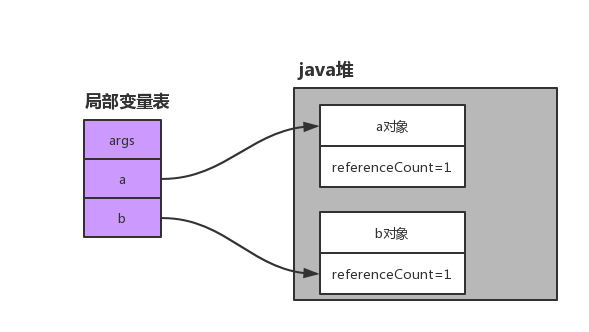
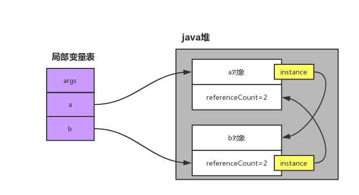
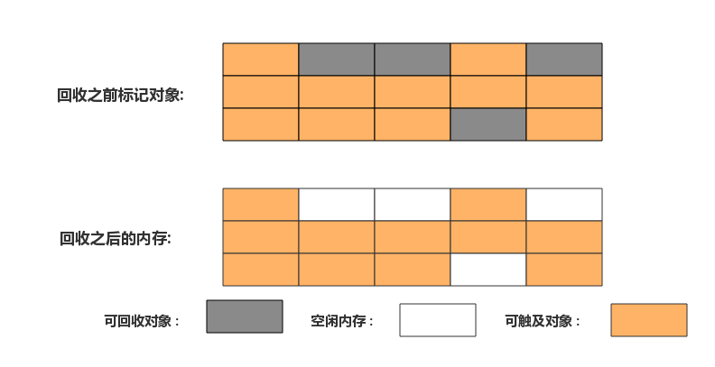

# 垃圾收集器
> java不像C和C++一样, 需要自己去释放内存,  因为java虚拟机有垃圾收集器, 能在创建对象时分配空间, 对象不用时自己判断是否回收内存, 那么随之而来的就是如果内存出现问题java开发人员排查更加困难

- [x] 有效对象判断
    - [x] 引用计数法
    - [x] 根搜索算法
- [ ] 垃圾收集算法
- [ ] 垃圾收集器类型
- [ ] 内存的分配和回收

## 有效对象判断
> 用一定的算法来判断对象是否有效, 然后把筛选出来的对象通过垃圾收集器进行一个内存回收

### 引用计数法
这种方式会给每个对象做一个初始的计数值 `0` , 当对象被引用时引用计数器 `+1` , 当变量放弃引用或者被销毁时, 计数器就 `-1`。 当一个对象为 `0` 时则垃圾收集器会对其进行一个内存释放

<div align="center">  </div>

**引用计数器**
1. 当引用计数器 `0` 时就可以直接进行内存回收。效率比较高, 没有延迟
2. 需要为每个对象额外添加引用计数器
3. 每次被引用都要改变计数器的数值
4. 最重点的是无法检测出来循环引用问题


**循环引用的案例**

```java {.line-numbers}
public  class CycleReferenceTest {
    private CycleReferenceTest instance;

    public  static void main(String[] args){
        CycleReferenceTest a = new CycleReferenceTest();
        CycleReferenceTest b = new CycleReferenceTest();

        a.instance = b;
        b.instance = a;
    }
}
```

<div align="center">  </div>

java虚拟机的有效对象判断并不是采用引用计数算法。


### 根搜索算法
以某些对象为 `GC ROOT` 节点, 当一个对象不在任何 `GC ROOT` 链上时, 该对象就是不可触及的, 可以被垃圾收集器回收内存。作为 `GC ROOT` 节点的有下面几种变量引用:

1. 虚拟机栈 (局部变量表, 操作数栈) 中引用的对象
2. 方法区中的静态属性引用的对象
3. 方法区中常量引用的对象
4. 本地方法栈中JNI (Native方法) 的引用对象

`虚拟机栈` 和 `本地方法栈` 可能有多个, 在运行时存在的栈内的局部变量表和操作数栈中的引用对象都可以作为 `GC ROOT` , 当其他对象没有直接或间接和这些 `GC ROOT` 对象有联系时, 说明这些对象是可能会被回收内存。随着栈帧的销毁, 部分 `GC ROOT` 对象会被回收。


`方法区中的静态属性引用的对象` 和 `方法区中常量引用的对象` 他们是类型拥有的, 当其他对象引用他们或者被他们引用, 证明这些对象是有效对象。如果一个对象不是上面一种, 也不是这种可触及, 那这个对象就是不可触及对象, 会被垃圾收集器收集。当这些类型被卸载的时候, 那这些 `GC ROOT` 对象也会被回收。

**类型被回收的条件:**

一般类型被回收的条件比较苛刻, 即使下面所有条件都满足, 也有可能不会被回收

1. 该类型的所有实例都被回收, 在堆中不存在该类型的任何实例
2. 加载该类的类加载器已被回收
3. 该类对应的Class对象没有在任何地方被引用

当程序中大量使用反射, 动态代理, CGLib等字节码编程的场景下, 频繁自定义类加载器的下情况下, 都需要类型卸载的功能。


## 垃圾收集算法
`Java虚拟机规范` 并没有要求具体的GC算法, 每个厂商都可能有不同的GC算法。

### 标记 - 清除算法

1. 首先标记出需要回收的对象
2. 回收对应的内存

<div align="center">  </div>

主要的缺点是: `GC` 回收完后, 创建一个比较大的对象时, 内存时足够的, 由于内存碎片比较多, 导致 `GC` 频繁回收降低系统性能
 
### 复制算法

1. 把内存划成两份大小相等的内存
2. 只使用其中一部分, 如果当其中一个内存需要 `GC` 时, 就把有效的对象复制到另一个空闲的内存中, 把之前的内存全部清理掉

这样有效的解决了上面 `标记清除算法` 内存碎片导致的弊端, 但是随之我们也浪费了一半的内存空间, 来做复制使用。 还有更重点的就是如果对象存活率非常高的情况下, 复制量也会非常大, 也会严重消耗性能

### 标记 - 整理算法

1. 首先标记需要清除的可回收对象
2. 把可触及对象移到内存的一端 (此操作是找到存活对象, 把可存在对象直接移到一端, 移动的时候要知道 `offset` (偏移地址), 移动成功后要修改 `offset`)
3. 清除边界以外的所有对象


