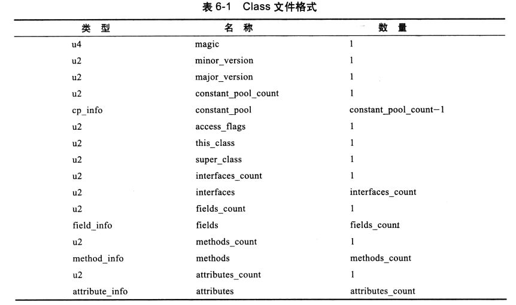
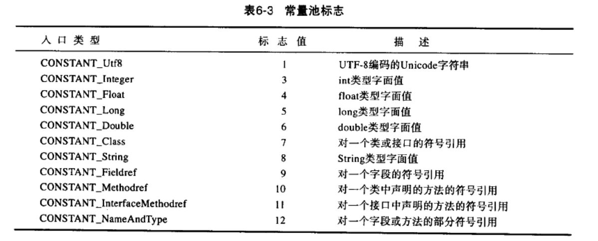
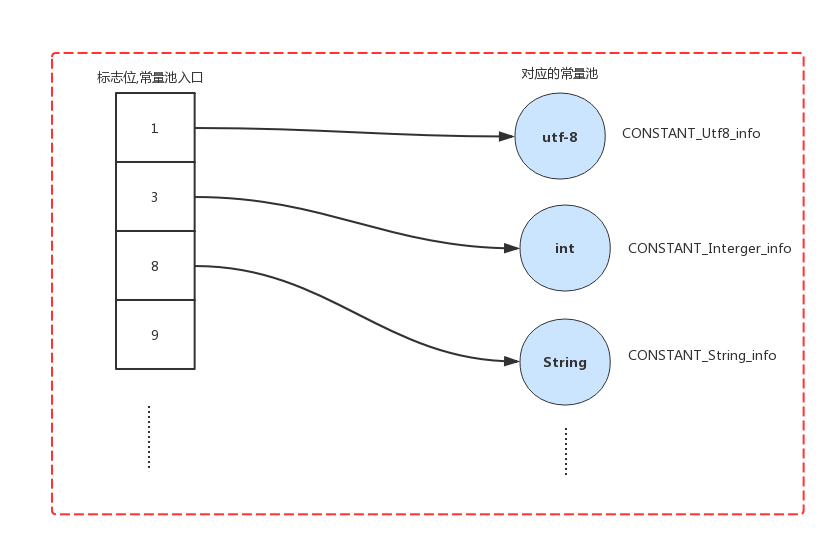
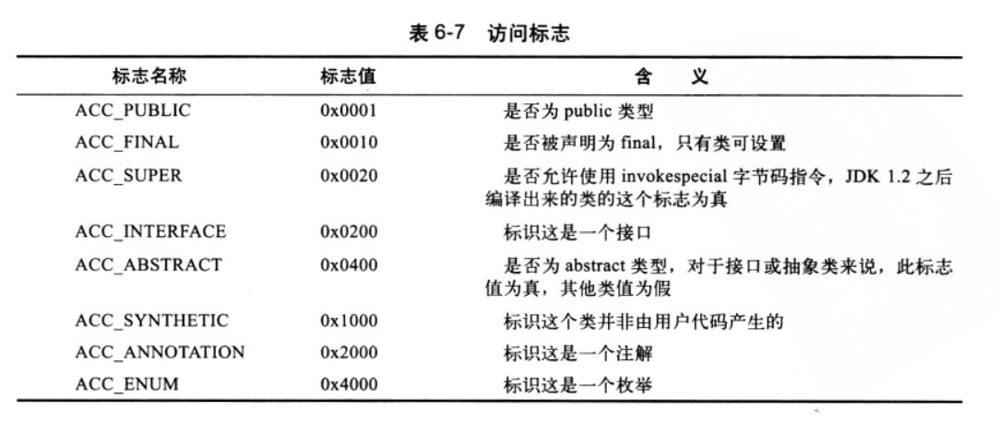
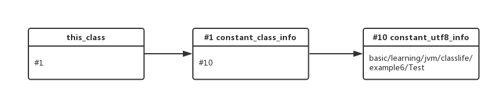
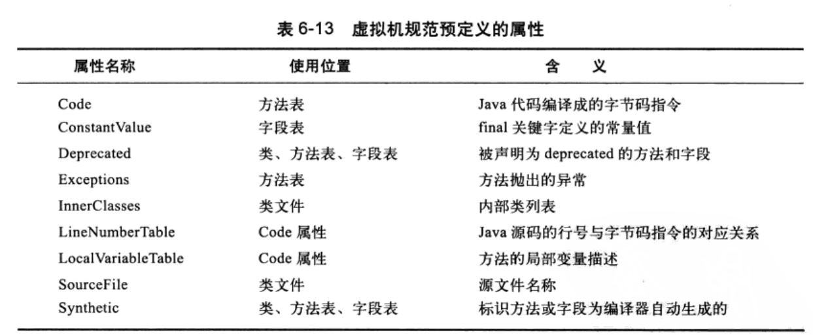

# Class文件学习
> class文件由java编译器编译*.java文件生成的二进制字节码文件，class文件交由jvm来进行加载执行

1. 为什么要编译成class文件
2. class文件的结构

## 1. 为什么要编译成class文件
> java语言跨平台性的实现主要归于class文件和java虚拟机

1. 把java代码统一编译成class文件，由不同平台的java虚拟机进行加载执行，达到跨平台性
2. class文件不仅仅可以由java语言编译成，其他语言如果准寻class文件的规范，同样也能被java虚拟机执行

编译class文件是为了跨语言，跨平台，使各种语言对应自己的class编译器编译成class文件，在java虚拟机上执行


## 2. class文件的结构
> class比较紧凑没有分隔符，没有多余的字符，结构是严格规定

**class文件的数据结构是无符号数和表来进行存储的**

|字节|标识|
|----|----|
|u1|1个字节无符号|
|u2|2个字节无符号|
|u4|4个字节无符号|
|u8|8个字节无符号|

**class文件格式**
表是以_info结尾的



Class文件简介:

1. 魔数
是class文件前4个字节固定的字符
2. minor_version和major_version
JDK次版本号和主版本号
3. 常量池(constant_pool)和constant_pool_count
constant_pool里面包含很多个常量池的入口找到对应的池子入口后，就可以找到对应一类的常量值constant_pool_count是常量池有多少个，但是会比常量池多一个因为常量池是从1开始的。

常量池的标志位如下图:


每个标志位对应某一类型的常量池，通过标志位解析找到对应常量池，常量池的名称是入口类型后面加上_info代表对应的表



除了字面常量(我们常说的String常量池)外，还有一些符号引用
    1. 类和接口的全限定名
    2. 字段名称和描述符
    3. 方法名称和描述符
描述符是对字段或者方法的描述，像Name字段是类型`String`限定符是`private` ,getName是方法返回值类型是`String` 参数是``。
具体jvm在解析阶段是怎么把符号引用解析成具体引用具体参考[符号引用解析]()

4. access_flags
该2字节表示类或者接口的描述,主要有一下标识:



例如如果是接口或者抽象类就不能有final字段,修饰只有public或者默认权限，未使用的位置为0

下面是使用`javap -verbose`查看字节码输出的东西
```text
public class basic.learning.jvm.classlife.example6.Test implements java.lang.Cloneable
  minor version: 0
  major version: 49
  flags: ACC_PUBLIC, ACC_SUPER
```
5. this_class、super_class、interface_count、interfaces
- 这4个除了interface_count外，其他的都是对常量池的索引.this_class是类的全限定名，super_class是父类的全限定名,interfaces是一组接口的全限定名
- interface_count是该类implement多少接口
- this_class保存有我们之前讲的常量池的索引,他会先去CONSTANT_class_info中查找，然后再到CONSTANT_Utf8_info查找对应的全限定名
其他类类似，他们合起来秒速了类的继承和实现的关系

```text
Constant pool:
   #1 = Methodref          #4.#20         // java/lang/Object."<init>":()V
   #2 = Class              #21            // basic/learning/jvm/classlife/example6/Test
  #21 = Utf8               basic/learning/jvm/classlife/example6/Test
  #22 = Utf8               java/lang/Object
  #23 = Utf8               java/lang/Cloneable
```
我们可以看到#2 指向#21 找到`basic/learning/jvm/classlife/example6/Test`权限定名
查找方式可以参考下图:



1. fields_count和field_info
fields_count是类变量和实例变量的总和
fields是该类(不包括父类和实现的接口的变量)实例变量和类变量列表，当然列表中也有编译器再编译阶段自己添加的字段，如内部类引用外部类字段(会有个标识)
field_info是该字段的描述如果是final修饰的还会有常量值，其他的则是放在常量池中的

7. methods和method_count
- method_count是该类实例方法和类方法的总和

- methods是类方法的列表

- method_info包含了方法一些相关的信息。如果不是抽象，或者本地方法的情况下，那么method_info中就会有局部变量所需的栈空间长度,方法捕获的异常表,局部变量表，以验证的异常表

8. attributes_count和attributes
- attributes_count属性表有多少个
- attributes属性表的集合
- attribute_info 它再class文件和方法表和字段表中都有自己的属性表




